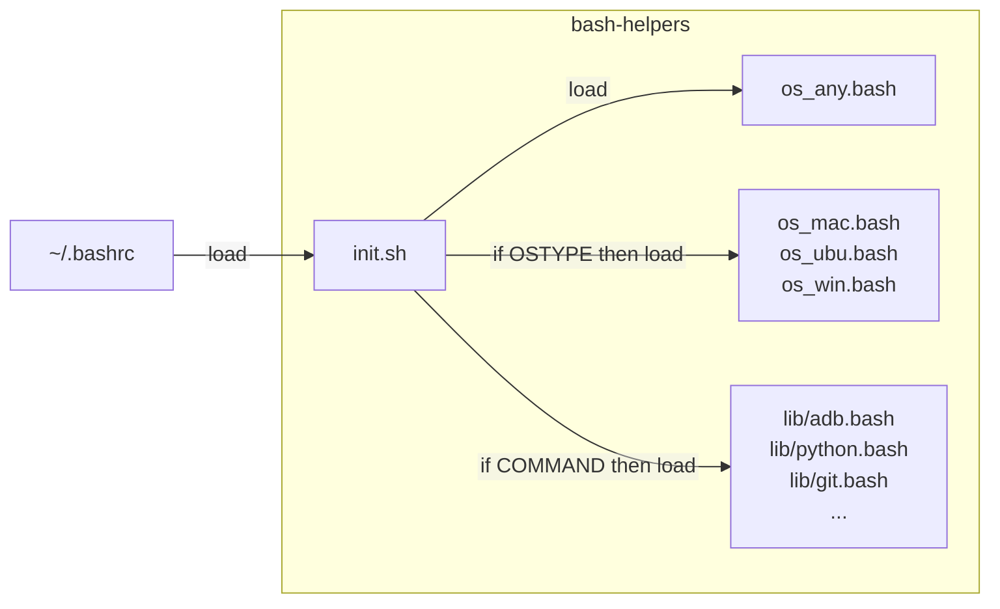

<h1 align="center"></h1>

# bash-helpers

Template to support you create multi-OS bash helpers (win MSYS2/GitBash/WSL, ubu, mac). Useful to you organize your helpers in `OS-dependent` or `command-dependent`. The [init.sh](init.sh) load `OS-dependent` from `os_*.bash` files after testing `$OSTYPE` and load `command-dependent` from `lib/*.bash` after testing `type <command>`. 
The project logo refers to the synthetic chemical element Bohrium, which also has BH's initials.




## Install

The bash-helpers project has two requirements: a `bash shell` and `git`. So, run on a `bash shell` with `git`:
```bash
  git clone https://github.com/alanlivio/bash-helpers ~/.bh &&\
    echo "source ~/.bh/init.sh" >> ~/.bashrc &&\
    source ~/.bashrc
```

On Win, you run the above command at GitaBash installed with [GitForWindows](https://gitforwindows.org). If you also use WSL, you can share the same BH repo by doing a symbolic link to it with `ln -s /mnt/c/<user>/.bh ~/.bh`.

## OS-dependent samples

### os_any

* `home_clean`: remove files/dirs defined in BH_HOME_CLEAN.
* `dotfiles_backup`: backup files/dirs defined in BH_DOTFILES.
* `dotfiles_diff`: show diff files/dirs defined in BH_DOTFILES.
* `dotfiles_install`: restore files/dirs defined in BH_DOTFILES.
* `decompress_from_url`: fetch and decompress to a given folder.
* `decompress`: extract from multiple formats to a given folder.
* `folder_count_files`: count files in the current folder
* `folder_count_files_recursive`: count files in the current and subfolder
* `folder_sorted_by_size`: list dir sorted by item size.
* `user_sudo_nopasswd`:  disable password when calling sudo (user must be in sudoers).

Some of the above helpers use `BH_*` vars from `~/.bashrc`, see examples at [skel/.bashrc](skel/.bashrc).
See more OS-independent helpers  [os_any.bash](os_any.bash) folder.

### os_ubu

* `ubu_update`: update os and apt packages. If defined BH_PKGS_APT, install them. 
* `gnome_sanity`: enable dark mode, disable animations, clean taskbar (e.g., small icons), uninstall pre-installed and not used apps (e.g., weather, news, calendar, solitaire).
* `deb_install_url`: fetch and install a deb package.

See more ubu helpers in [os_ubu.bash](os_ubu.bash).

### os_mac

* `mac_update`: update os and brew packages. If defined BH_PKGS_BREW, install them. 
* `mac_install_brew`: install brew package manager

See more mac helpers in [os_mac.bash](os_mac.bash).

### os_win

* `win_update`: update os and winget packages. If defined BH_PKGS_WINGET, install them. 
* `winpath`: return path in windows format. It uses `cygpath -m` in GitBash/MSYS2, while uses `wslpath -m` in WSL.
* `win_policy_reset`: reset group policy.
* `win_disable_apps_preinstalled`:  remove unused apps. It is a wrapper [win_disable_apps_preinstalled.ps1](scripts/win_disable_apps_preinstalled.ps1).
* `win_disable_hotkeys`: disable acessibility,rotation, lang hotkeys. It is a wrapper [win_disable_hotkeys.ps1](scripts/win_disable_hotkeys.ps1).
* `win_disable_password_policy`: disable password policy requirement. It is a wrapper [win_disable_password_policy.ps1](scripts/win_disable_password_policy.ps1).
* `win_disable_pc_folders`:  disable link folders on This PC. It is a wrapper [win_disable_pc_folders.ps1](scripts/win_disable_pc_folders.ps1).
* `win_disable_sounds`: disable systems sound (e.g., bells). It is a wrapper [win_disable_sounds.ps1](scripts/win_disable_sounds.ps1).
* `win_enable_hyper_v`: enable hyper-v virtualization. It is a wrapper [win_enable_hyper_v.ps1](scripts/win_enable_hyper_v.ps1).
* `win_path_add`: add dir to path. It is a wrapper [win_path_add.ps1](scripts/win_path_add.ps1).
* `win_env_add`: add variable to env variables.
* `win_env_show`: show env variables.
* `home_clean_win`: remove files/dirs defined in BH_HOME_CLEAN (even inside WSL), and hide from explorer dotfiles (.*) and others defined in BH_WIN_HIDE_HOME.
* `start_open_recycle_bin`: explorer open trash folder.
* `start_open_startmenu_all`explorer opens the start menu folder for all users.
* `start_open_startmenu_user`: explorer opens the start menu folder for the current user.
* `start_from_wsl` (from WSL): call cmd `start` or `explorer`.
* `msys2_update`: update msys2 packages. If defined BH_PKGS_MSYS2, install them. 
* `msys2_search`: search for msys2 package
* `msys2_list_installed`:  list installed msys2 packages
* `msys2_use_same_home`: set msys2 to use same home as win user.

See more win helpers in [os_win.bash](os_win.bash).

## command-dependent samples

### Python

* `python_clean_cache`: clean cache
* `python_check_tensorflow`: check Tensorflow GPU support.
* `python_setup_install_local`: install from a pkg folder with setup.py.
* `python_setup_upload_testpypi`: upload to [testpypi repository](https://test.pypi.org/) from a pkg folder with setup.py.
* `python_setup_upload_pip`: upload to pip from a pkg folder with setup.py.
* `conda_env_create_from_enviroment_yml`: create env from environment.yml
* `conda_env_update_from_enviroment_yml`: update env from environment.yml

See more helpers in [lib/python.bash](lib/python.bash).

### Docker

* `docker_prune`: clean unused images and containers
* `docker_run_at_same_folder`: run, from an image, a command line using the current folder as the working folder

See more helpers in [lib/docker.bash](lib/docker.bash).

### others

See other commands at:
* [lib/adb.bash](lib/adb.bash)
* [lib/cmake.bash](lib/cmake.bash)
* [lib/ffmpeg.bash](lib/ffmpeg.bash)
* [lib/git.bash](lib/git.bash)
* [lib/gs.bash](lib/gs.bash)
* [lib/lxc.bash](lib/lxc.bash)
* [lib/meson.bash](lib/meson.bash)
* [lib/pandoc.bash](lib/pandoc.bash)
* [lib/wget.bash](lib/wget.bash)
* [lib/youtube-dl.bash](lib/youtube-dl.bash).

## References

This project takes inspiration from:

* <https://github.com/Bash-it/bash-it>
* <https://github.com/milianw/shell-helpers>
* <https://github.com/wd5gnr/bashrc>
* <https://github.com/martinburger/bash-common-helpers>
* <https://github.com/jonathantneal/git-bash-helpers>
* <https://github.com/donnemartin/dev-setup>
* <https://github.com/aspiers/shell-env>
* <https://github.com/nafigator/bash-helpers>
* <https://github.com/TiSiE/BASH.helpers>
* <https://github.com/midwire/bash.env>
* <https://github.com/e-picas/bash-library>
* <https://github.com/awesome-windows11/windows11>
* <https://github.com/99natmar99/Windows-11-Fixer>
* <https://github.com/W4RH4WK/Debloat-windows-10/tree/master/scripts>
