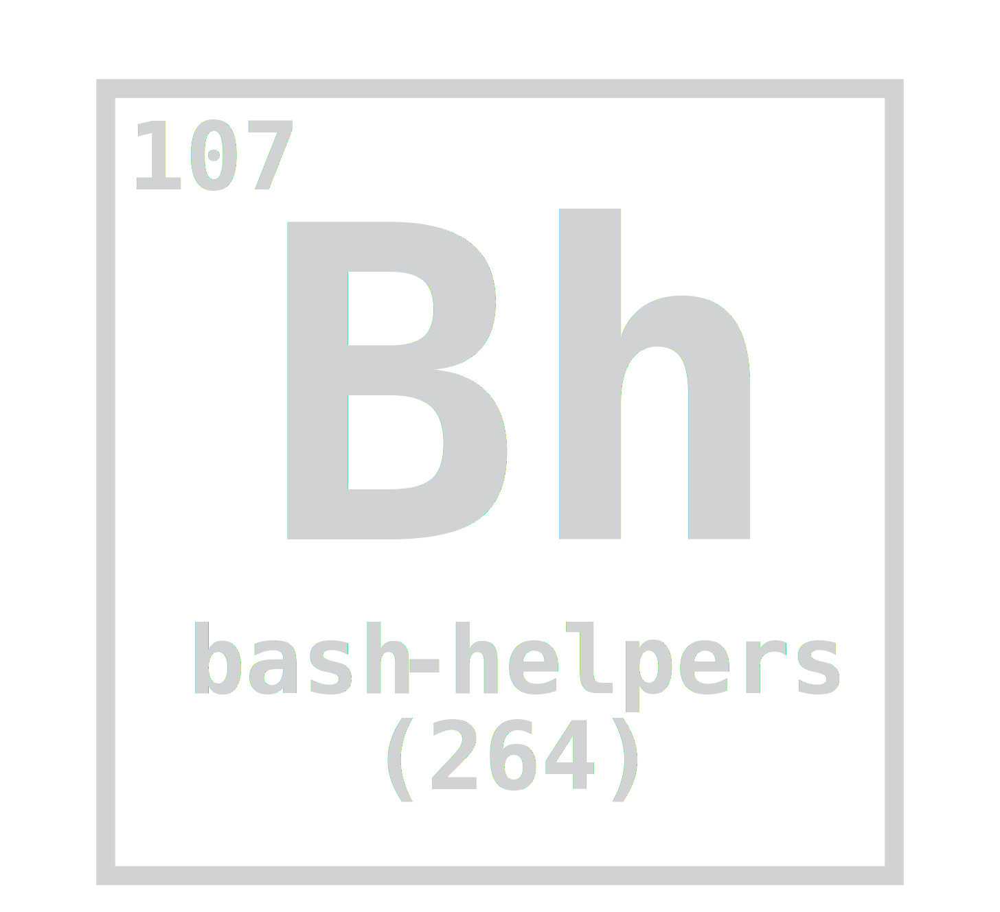
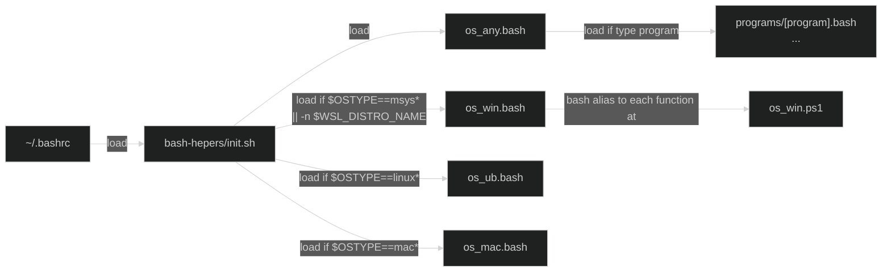

<h1 align="center"></h1>

# bash-helpers

Template to easily create multi-OS bash helpers for Windows (MSYS2/GitBash/WSL), Ubuntu, and Mac. It is useful to let you organize helpers in `OS-dependent` or `program-dependent`. The diagram below illustrates how the [init.sh](init.sh) loads `OS-dependent` from `os_*.bash` (files after testing `$OSTYPE`) and loads `program-dependent` from `programs/<program>.bash` (after testing `type <program>`). At Windows, it also loads ps1 functions from `os_win.ps1` as an alias.
The project logo refers to the synthetic chemical element Bohrium, which also has BH's initials.



## Install

The bash-helpers project has two requirements: a `bash shell` and `git`. So, run on a `bash shell` with `git`:

```bash
  git clone https://github.com/alanlivio/bash-helpers ~/.bh &&\
    echo "source ~/.bh/init.sh" >> ~/.bashrc &&\
    source ~/.bashrc
```

Alternatively, you can see the [skel/.bashrc](skel/.bashrc) as an example.

On Win, you run the above program at GitaBash installed with [GitForWindows](https://gitforwindows.org). If you also use WSL, you can share the same BH repo by doing a symbolic link to it with `ln -s /mnt/c/<user>/.bh ~/.bh`.

## OS-dependent

### os_any

OS-independent helpers are defined in [os_any.bash](os_any.bash). See some below.

* `bashrc_reload`: reload ~/.bashrc.
* `bh_dotfiles_backup`,`bh_dotfiles_diff`,`bh_dotfiles_install`: backup, diff and install files/dirs defined in BH_DOTFILES. See a BH_DOTFILES var example at [skel/.bashrc](skel/.bashrc).
* `decompress_from_url`: fetch and decompress to a given folder.
* `decompress`: decompress from multiple formats to a given folder.
* `folder_count_files`: count files in the current folder.
* `folder_count_files_recursive`: count files in the current and subfolder.
* `folder_sorted_by_size`: list dir sorted by item size.
* `user_sudo_no_password`: disable password when calling sudo (user must be in sudoers).

### os_ubu

Ubuntu helpers are defined in [os_ubu.bash](os_ubu.bash). See some below.

* `ubu_update`: update os and apt.
* `deb_install_file_from_url`: fetch and install a deb package.
* `ubu_install_miniconda`: fetch and install miniconda.
* `user_sudo_no_password`: remove password for current user sudo.
* `gnome_dark_mode`: enable gnome dark mode.
* `gnome_nautilus_list_view`: enable nautilus list view.

### os_mac

Mac helpers are defined in [os_mac.bash](os_mac.bash). See some below.

* `mac_update`: update os and brew.
* `mac_install_brew`: install brew package manager

### os_win

Win helpers are defined in [os_win.bash](os_win.bash) and [os_win.ps1](os_win.ps1), see some below.

* `start_from_wsl`: (from wsl): call cmd `start` from current wsl path.
* `wsl_install_cuda_cudnn`: (from wsl): install cuda and cudadnn.
* `win_install_ubuntu`: install WSL 2 and Ubuntu.
* `win_disable_osapps_unused`: remove unused apps.
* `win_disable_password_policy`: disable password policy requirement (require sudo).
* `win_disable_shortcuts_unused`disable accessibility, rotation, lang hotkeys.
* `win_disable_sounds`: disable systems sound (e.g., bells).
* `win_disable_web_search_and_widgets`: disable Windows Web search and Widgets (require sudo on win11).
* `win_disable_edge_ctrl_shift_c`: disable Edge shorcut ctrl+shift+c to developer (require sudo).
* `win_disable_explorer_clutter`: disable explorer shows recent, frequent, and recommendations and hides extensions.
* `win_disable_taskbar_clutter`: disable taskbar shows task search, view, copilot buttons, and animation.
* `win_enable_osapps_essentials`: install WindowsStore, WindowsCalculator, WindowsPhotos, WindowsFeedbackHub, and WindowsCamera.
* `win_enable_sudo`: enable sudo elevation (using sudo config at win11 and gsudo at win10).
* `win_enable_hyperv`: enable hyper-v virtualization (require sudo).
* `win_env_add`: add variable to user env variables.
* `win_env_add_machine`: add variable to system env variables (require sudo).
* `win_env_show`: show env variables.
* `win_explorer_hide_home_dotfiles`: set as hidden files starting with "." at home folder
* `win_path_add`: add dir to the path at user scope.
* `win_path_show`: show windows path as list.
* `win_image_cleanup`: win image cleanup (require sudo).
* `win_policy_reset`: reset group policy (require sudo).
* `win_ssh_agent_and_add_id_rsa`: set ssh-agent to automatically startup using $HOME/.ssh/id_rsa as Identity (require sudo).
* `win_update`: update winget packages and, if has sudo, install os update.
* `winpath`: get current path in Windows format. It uses `cygpath -m` in GitBash/MSYS2, while uses `wslpath -m` in WSL.

## program-dependent

### Python

Python helpers are defined in [programs/python.bash](programs/python.bash). See some below.

* `python_clean_cache`: clean cache
* `python_check_tensorflow`: check Tensorflow GPU support.
* `python_setup_install_local`: install from a pkg folder with setup.py.
* `python_setup_upload_testpypi`: upload to [testpypi repository](https://test.pypi.org/) from a pkg folder with setup.py.
* `python_setup_upload_pip`: upload to pip from a pkg folder with setup.py.
* `conda_env_create_from_enviroment_yml`: create env from environment.yml.
* `conda_env_update_from_enviroment_yml`: update env from environment.yml.

### Docker

Docker helpers are defined in [programs/docker.bash](programs/docker.bash). See others below.

* `docker_prune`: clean, unused images and containers
* `docker_run_at_same_folder`: run, from an image, a program line using the current folder as the working folder

### others

See other programs at:

* [programs/adb.bash](programs/adb.bash).
* [programs/cmake.bash](programs/cmake.bash).
* [programs/ffmpeg.bash](programs/ffmpeg.bash).
* [programs/git.bash](programs/git.bash).
* [programs/gs.bash](programs/gs.bash).
* [programs/lxc.bash](programs/lxc.bash).
* [programs/meson.bash](programs/meson.bash).
* [programs/pandoc.bash](programs/pandoc.bash).
* [programs/wget.bash](programs/wget.bash).
* [programs/youtube-dl.bash](programs/youtube-dl.bash).

## References

This project takes inspiration from:

* <https://github.com/Bash-it/bash-it>
* <https://github.com/milianw/shell-helpers>
* <https://github.com/wd5gnr/bashrc>
* <https://github.com/martinburger/bash-common-helpers>
* <https://github.com/jonathantneal/git-bash-helpers>
* <https://github.com/donnemartin/dev-setup>
* <https://github.com/aspiers/shell-env>
* <https://github.com/nafigator/bash-helpers>
* <https://github.com/TiSiE/BASH.helpers>
* <https://github.com/midwire/bash.env>
* <https://github.com/e-picas/bash-library>
* <https://github.com/awesome-windows11/windows11>
* <https://github.com/99natmar99/Windows-11-Fixer>
* <https://github.com/W4RH4WK/Debloat-windows-10/tree/master/scripts>
