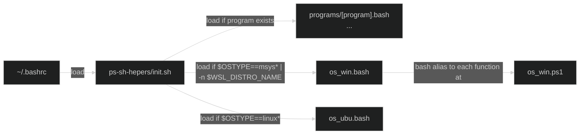
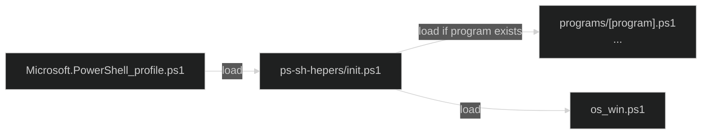

# ps-sh-helpers

Lib template for creating powershell and bash helpers. It let you organize helpers in `OS-dependent` or `program-dependent` and load them from powershell or bash. It loads `OS-dependent` from `os_*` and loads `program-dependent` from `programs/<program>.*`.



<div style="transform: scale(0.7); transform-origin: top left;">


<div>

## Install

From bash, install ps-sh-helpers by:

```bash
git clone https://github.com/alanlivio/ps-sh-helpers ~/.ps1-sh-helpers
echo "source ~/.ps-sh-helpers/init.sh" >> ~/.bashrc
```

From powershell, install ps-sh-helpers by:

```ps1
git clone https://github.com/alanlivio/ps-sh-helpers ${env:userprofile}\.ps1-sh-helpers
$contentAdd = '. "${env:userprofile}\.ps-sh-helpers\init.ps1""'
Set-Content "${env:userprofile}/OneDrive/Documents/WindowsPowerShell/Microsoft.PowerShell_profile.ps1" $contentAdd
```

## References

This project takes inspiration from:

- <https://github.com/Bash-it/bash-it>
- <https://github.com/milianw/shell-helpers>
- <https://github.com/wd5gnr/bashrc>
- <https://github.com/martinburger/bash-common-helpers>
- <https://github.com/jonathantneal/git-bash-helpers>
- <https://github.com/donnemartin/dev-setup>
- <https://github.com/aspiers/shell-env>
- <https://github.com/nafigator/bash-helpers>
- <https://github.com/TiSiE/BASH.helpers>
- <https://github.com/midwire/bash.env>
- <https://github.com/e-picas/bash-library>
- <https://github.com/awesome-windows11/windows11>
- <https://github.com/99natmar99/Windows-11-Fixer>
- <https://github.com/W4RH4WK/Debloat-windows-10/tree/master/scripts>
